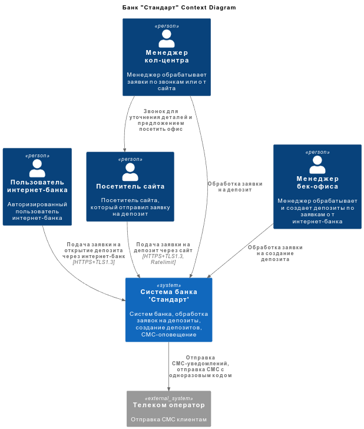
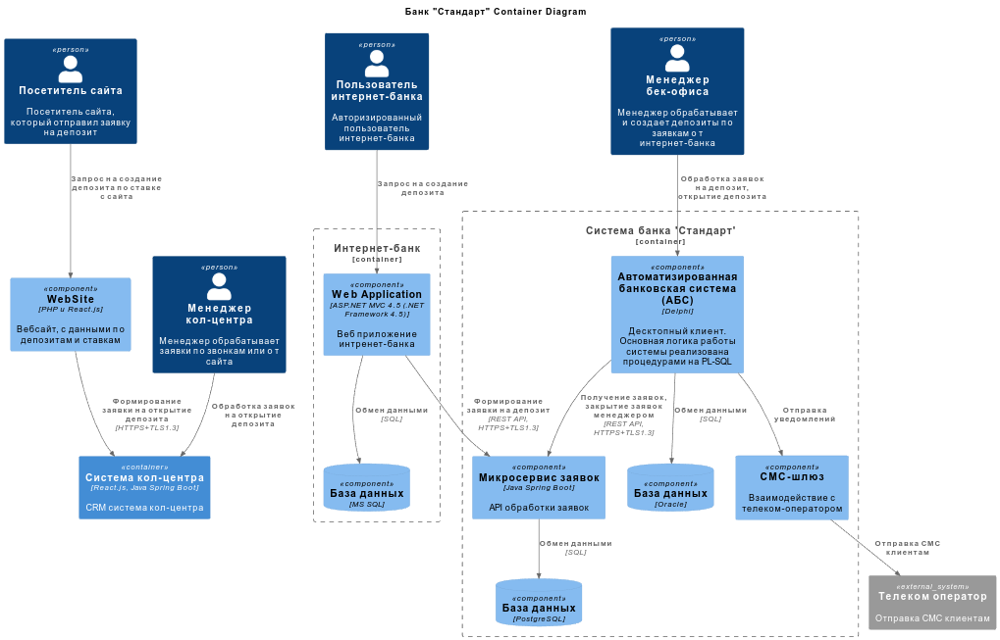

### **Название задачи:**

### **Автор:**

### **Дата:**

### **Функциональные требования**

Опишите здесь верхнеуровневые Use Cases. Их нужно оформить в виде таблицы с пошаговым описанием:

| **№** | **Действующие лица или системы** | **Use Case**                 | **Описание**                                                                                                                                                                                                                                                                                                                                                                                                                                                                                                                                                                                                                                                                                                                         |
|:-----:|:-------------------------------- |:---------------------------- |:------------------------------------------------------------------------------------------------------------------------------------------------------------------------------------------------------------------------------------------------------------------------------------------------------------------------------------------------------------------------------------------------------------------------------------------------------------------------------------------------------------------------------------------------------------------------------------------------------------------------------------------------------------------------------------------------------------------------------------ |
| UC1   | Посетитель сайта, Сайт           | Оформление заявки на депозит | 1. Посетитель сайта просматривает список доступных депозитов и актуальные ставки. 2. Выбрав интересуемый депозит, пользователь нажимает кнопку "Подать заявку" 3. В открышемся окне он заполняет следующие поля: Ф.И.О. (обязательное), Телефон (обязательное), Комментарий (необязательное) и нажимает кнопку "Отправить".  4. Система присылает в СМС одноразовый код подтверждения для пользователя.  5. Пользователь отправляет код 6. При успешной проверке кода, пользователю показывается сообщение, что с ним в скором времени свяжется сотрудник банка, для уточнения деталей.  7. Сайт передает данные по шифрованным каналам связи в систему кол-центра, где формируется заявка на депозит.   |
| UC2   | Посетитель сайта, Интернет-банк  | Авторизация                  | 1. Пользователь интернет-банка вводит логин и пароль. 2. При успешной проверке хеша логина и пароля, система присылает в СМС одноразовый код подтверждения. 3. Пользователь вводит одноразовый код подтверждения 4. При успешной проверке кода, пользователь попадает на страницу личного кабинета                                                                                                                                                                                                                                                                                                                                                                                                                       |
| UC3   | Посетитель сайта, Интернет-банк  | Оформление заявки на депозит | 1. Пользователь интернет-банка просматривает список доступных депозитов и актуальные персональные ставки. 2. Выбрав интересуемый депозит, пользователь нажимает кнопку "Подать заявку" 3. Система присылает в СМС одноразовый код подтверждения для пользователя.  4. Пользователь отправляет код 5. При успешной проверке кода, пользователю показывается сообщение, что он получит СМС-уведомление после подтверждения размера ставки и открытия депозита.  6. Интернет-банк передает данные по шифрованным каналам связи в АБС, где формируется заявка на депозит.                                                                                                                                        |
| UC4   | Оператор кол-центра              | Обработка заявки на депозит  | 1. Оператор кол-центра видит необработанные заявки на депозит в CRM системе колцентра 2. Он назначает заявку на себя 3. Если в заявке указан пользователь не являющийся клиентом банка, то сотрудник запрашивает доступные депозиты и ставки в АБС. 4. После сотрудник кол-центра связывается с пользователем для уточнения деталей и формирует заявку на посещение фронт-офиса банка. 5. Если в заявке указан клиент банка, то сотрудник сверяется с данными заявки и другими доступными предложениями. После связывается с пользователем с предложением оформить депозит самому в интернет-банке или посетить офис для открытия депозита                                                                           |
| UC5   | Менеджер бэк-офиса по депозитам  | Обработка заявки на депозит  | 1. Менеджер бэк-офиса по депозитам видит необработанные заявки на депозит в АБС системе колцентра 2. Он назначает заявку на себя 3. Если в заявке указан пользователь являющийся клиентом банка и в заявке указано, что она сформирована в MVP, то сотрудник проверяет корректность указанных данных. 4. Если данные по депозиту и ставкам указаны корректно, то менеджер открывает депозит. Пользователю система отправляет СМС-уведомление об открытии депозита.  5. Если данные по депозиту и ставкам указаны некорректно, то менеджер как раньше руками формирует предложение по депозиту и отправляет его клиенту. Так же команде цифровой трансформации формируется отчет о некорректной работе MVP.           |

### **Нефункциональные требования**

Опишите здесь нефункциональные требования и архитектурно значимые требования.

| **№**  | **Требование**                                                                                                                                                                                               |
| ------ | ------------------------------------------------------------------------------------------------------------------------------------------------------------------------------------------------------------ |
| **R**  | **Надёжность (Reliability)**                                                                                                                                                                                 |
| R1     | Все сервисы должны работать 24/7                                                                                                                                                                             |
| R2     | Все сервисы должны быть доступны в 99,9%                                                                                                                                                                     |
| R3     | В случае роста числа клиентов сбой в работе интернет-банк не должен превышать нескольких пары часов.                                                                                                         |
| R4     | Передаваемые данные от сайта и интернет-банка необходимо защищать с помощью механизма шифрования трафика. Использование только HTTPS и протокола не ниже TLS 1.3                                             |
| R5     | Необходимо обеспечить резервирование всех баз и систем.                                                                                                                                                      |
| R6     | Необходимо обеспечить защиту от спама запросов со стороны сайта                                                                                                                                              |
| **P**  | **Производительность (Performance)**                                                                                                                                                                         |
| P1     | Отклик по всем операциям в интернет-банке должен быть максимально быстрым и занимать миллисекунды.                                                                                                           |
| P2     | Необходимо предусмотреть горизонтальное масштабирование всех баз и систем.                                                                                                                                   |
| P3     | Необходимо предусмотреть равномерное распределение нагрузки между серверами.                                                                                                                                 |
| **S**  | **Поддерживаемость (Supportability)**                                                                                                                                                                        |
| S1     | Компоненты системы должны иметь возможность независимой доработки и развертывания.                                                                                                                           |
| S2     | Функционал работы с СМС можно реализовать силами команды разработки банка.                                                                                                                                   |
| S4     | Необходимо внедрить интерационное тестирование.                                                                                                                                                              |
| **+R** | **+ Ограничения (Restrictions)**                                                                                                                                                                             |
| +R1    | При доработках во всех системах нужно как можно больше использовать технологии, которые уже есть в банке: Базы данных: MS SQL и Oracle. Среды программирования: ASP.NET, .NET Framework, Java, PHP, React.js |
| +R2    | АБС может масштабироваться только вертикально из-за своей базы данных.                                                                                                                                       |
| +R3    | В качестве очереди сообщений лучше использовать Kafka, но текущая версия платформы интернет-банка несовместима с ней.                                                                                        |

### **Решение**

На диаграмме контекста представлены основные пользователи системы, система банка "Стандарт" и внешние системы.   

На диаграмме контейнеров представлено решение с созданием дополнительного микросервиса обработки заявок на депозит. 

Для MVP предлагается создать новый микросервис, который будет получать от интернет-банка завку на создание депозита (соответствие требованиям S1, ). Отдельный микросервис легче масштабировать для нагрузки (P2, P3). Разработка ведется на Java Spring Boot и в команде есть специалисты знакомые с этим стеком. Их можно выделить в отдельную команду (+R1 ). База используется PostgreSQL, так же знакомая для команды (P1, P2).

Данный микросервис будет отвечать только за заявки, поэтому он будет соответствовать требованиям по отклику и доступности (R1, R2, R3). В случае роста данных, базу и микросервис можно масштабировать горизонтально по регионам (P2).

Для защиты данных, все запросы выполняются с использованием шифрования протокола HTTPS и TLS1.3 (R4). Для сохранности данных обязательно резервирование БД.

На первом этапе АБС будет запрашивать заявки напрямую у микросервиса заявок, но в дальнейшем можно применить асинхронный метод обработки заявок, например с использованием очереди сообщений Kafka (+R3)

### **Альтернативы**

1. **Разработка в системе кол-центра** 
   Система кол-центра представляет собой CRM-решение, которое подрядчик может доработать под требования обработки заявок. Менеджеры бек-офиса могут обрабатывать там заявки под своими учетками и создавать депозиты, через интеграцию системы кол-центра и АБС.  
   **Недостатки, ограничения, риски**:
   - будет ли CRM система удовлетворять требованиям;
   - стоимость доработки системы подрятчиком;
   - возможность интеграции с АБС.
2. **Доработка в АБС**
   АБС система представляет собой монолитное решение с основной логикой в БД. Данную систему тяжело масштабировать и соответствовать под требования по масштабированию, резервированию и времени отклика.  
   **Недостатки, ограничения, риски**:
   - высока стоимость и сложность доработки;
   - невозможность соблюдать функциональные требования.
