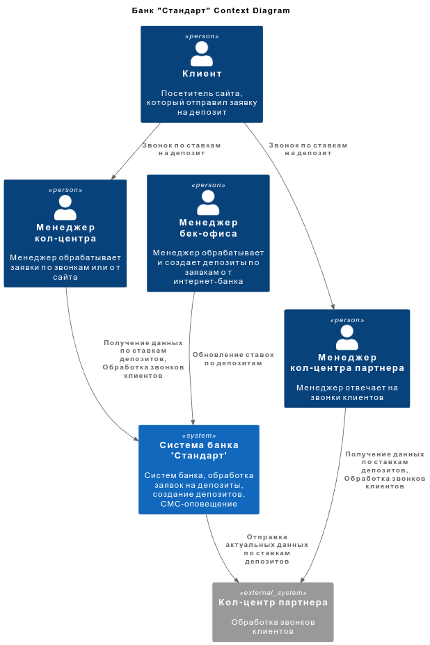
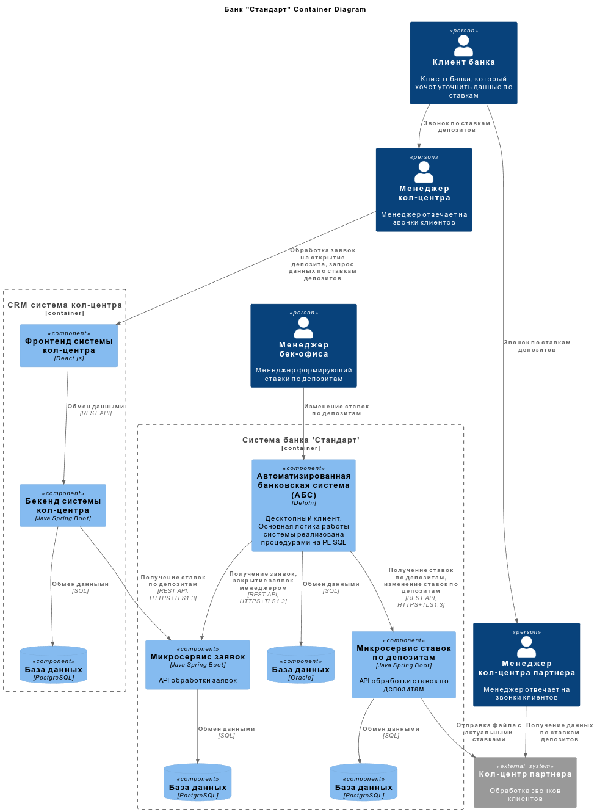

### **Название задачи:**

### **Автор:**

### **Дата:**

### **Функциональные требования**

Опишите здесь верхнеуровневые Use Cases. Их нужно оформить в виде таблицы с пошаговым описанием:

| **№** | **Действующие лица или системы** | **Use Case**                  | **Описание**                                                                                                                                                                                                                                                                                     |
|:-----:|:-------------------------------- |:----------------------------- |:------------------------------------------------------------------------------------------------------------------------------------------------------------------------------------------------------------------------------------------------------------------------------------------------ |
| U1    | Оператор кол-центра              | Ответ на звонок клиента       | 1. Оператор отвечает на звонок клиента.  2. Для консультации по ставкам, оператор обращается к разделу ставки в системе кол-центра.  3. Так же он может посмотреть статус заявки на депозит от клиента в системе кол-центра, если такая есть.                                            |
| U2    | Оператор кол-центра партнера     | Ответ на звонок клиента       | 1. Оператор отвечает на звонок клиента.  2. Для консультации по ставкам, оператор обращается к файлам, полученным от банка                                                                                                                                                                   |
| U3    | Менеджер бек-офиса по кредитам   | Изменение ставок по депозитам | 1. Сотрудник бек-офиса, занимающийся расчетом ставок меняет в АБС ставки по депозитам 2. Система делает запрос в микросервис ставок 3. Сервис ставок отдает актуальные данные на сайт и в интренет-банке 4. Сервис ставок обновляет файл по ставкам для системы кол-центра партнера. |

### **Нефункциональные требования**

Опишите здесь нефункциональные требования и архитектурно-значимые требования.

| **№**  | **Требование**                                                                                                                                                                                               |
|:------:|:------------------------------------------------------------------------------------------------------------------------------------------------------------------------------------------------------------ |
| **R**  | **Надёжность (Reliability)**                                                                                                                                                                                 |
| R1     | Файл с актуальными ставками в системе партнера должен обновляться раз в сутки на начало рабочего дня                                                                                                         |
| R2     | Файл с актуальными ставками в системе партнера должен обновляться в течении часа с момента изменения ставок                                                                                                  |
| **P**  | **Производительность (Performance)**                                                                                                                                                                         |
| P1     | Отображение изменения значения ставки по депозитам на сайте и в интренет-банке должно укладываться в 1 минуту.                                                                                               |
| P2     | Отклик по получению актуальных ставок по депозитам на сайте и в интернет-банке должен занимать не более 500 миллисекунд.                                                                                     |
| **+R** | **+ Ограничения (Restrictions)**                                                                                                                                                                             |
| +R1    | При доработках во всех системах нужно как можно больше использовать технологии, которые уже есть в банке: Базы данных: MS SQL и Oracle. Среды программирования: ASP.NET, .NET Framework, Java, PHP, React.js |
| +R2    | Данные по ставкам можно передать партнеру только файлом                                                                                                                                                      |

### **Решение**

Диаграмма контекста

Диаграмма контейнеров

Поскольку АБС банка представляет собой монолитное решение, тяжело потдающееся изменениям, то переход на микросервисы должен улучшить положение. Начать можно с того, что модно вынести обработку заявок на депозиты и значения ставок по депозитам в отдельные микросервисы. 

Решение разбить на микросервисы позволит соответствовать требованиям:

- масштабирование - можно запускать несколько экземпляров микрочервисовв и распределять нагрузк между ними;

- время отклика - повышение времени отклика , потому что микросервис работает только с одной сущностью;

- отказоустойчивость - отдельный микросервис проще тестировать и деплоить независимо от других элементов системы;

- резервирование - базы меньше, их проще резервировать.

Поэтому мы в рамках IT-трансформации создаем 2 новых микросервиса:

- заявки на депозит;

- ставки по депозитам.

Мы начинаем распиливать систему на микросервисы и разносить данные. Используются технологии и базы данных знакомые команде.

Микросервис ставок по депозитам предоставляет REST API для работы со ставками по депозитам. Он предоставляет актуальные данные по ставкам для всех систем и позволяет АБС менять их. Предлагается применить CQRS паттерн для проектирования этого микросервиса.

Этот сервис должен формировать файл с актуальными ставками по депозитам и отправлять его на FTP сервер партнера. Для этого партнер должен предоставить учетную запись и защищенное хранилище. В случае ошибки, можно отправить данные через email, чтобы партнер обработал данные вручную.

### **Альтернативы**

1. Оправка данных о ставках по электронной почте. Это решение самое дешевое.

**Недостатки, ограничения, риски**

- нужна будет ручная обработка данных, что черевато ошибками;

- возможны проблемы с почтой - письмо может недойти или попасть в спам.

2. S3 хранилище. Позволит предоставлять партнеру URL с актульным файлом. 

**Недостатки, ограничения, риски**

- самый дорогой вариант - аренда хранилища, доработка на стороне партнера.
